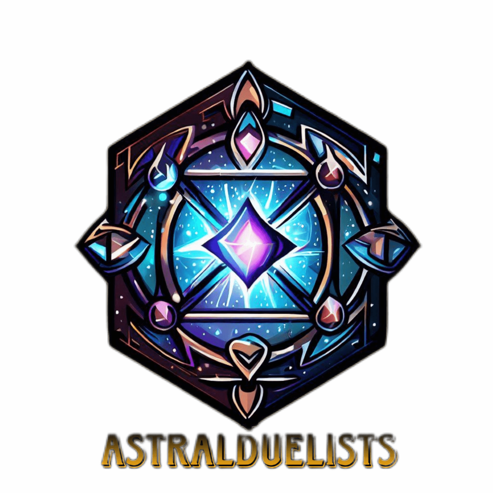

# AstralDuelists



Theme no 3: 🎯Artistry

Idea: Blockchain-Based Collectible Card Game (CCG)

We will create a decentralized Collectible Card Game (CCG) that utilizes blockchain technology for NFT-based cards and in-game assets. Players can collect, trade, and battle with unique digital cards, each represented as an NFT..

## ✨Features

- User Registration & Authentication
- Battles between player's cards.
- Card Minting & Trading.
- Leaderboard

## 🚀Run Locally

Clone the project

```bash
  git clone https://github.com/AYUSHMAN0503/AstralDuelists
```

Go to the project directory

```bash
  cd AstralDuelists
```

Install dependencies

```bash
  npm install
```

Start the server

```bash
  npm run dev
```

## 👨‍💻Contributing

Contributions are always welcome!

To merge your changes from the cloned repository back into the original repository on GitHub, you typically follow these steps:

- Step 1: Add the original repository as a remote (if you haven't done it already)

Navigate to the directory of your local clone:

```bash
cd /path/to/local/clone/
```

Add the original repository as a remote:

```bash
git remote add upstream <original_repository_url>
```

In the command above, <original_repository_url> should be replaced with the URL of the original repository. This step is important because it establishes a connection between your local repository and the original repository.

- Step 2: Commit and push your changes to your forked repository

Stage your changes

```bash
git add .
```

Commit the changes

```bash
git commit -m "Your commit message here"
```

Push the changes to your forked repository

```bash
git push origin master
```

- Step 3: Create a pull request on the original repository

Now, go to the original repository on GitHub and create a pull request from your forked repository.

## Copyright

Created by team Web3 Sailors for HackaTRON 5.0 || All rights reserved by Web3 Sailors

Created for [HackaTRON](https://trondao.org/hackatron/) | Copyright © Web3 Sailors.


## Status

🚧 **Under Construction** 🚧

This project is currently in the construction stage. We are actively working on developing and refining various aspects of the project. Keep in mind that things might change rapidly as we continue to make progress.
